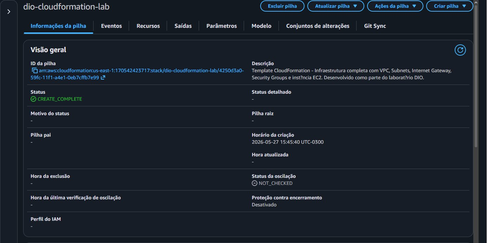
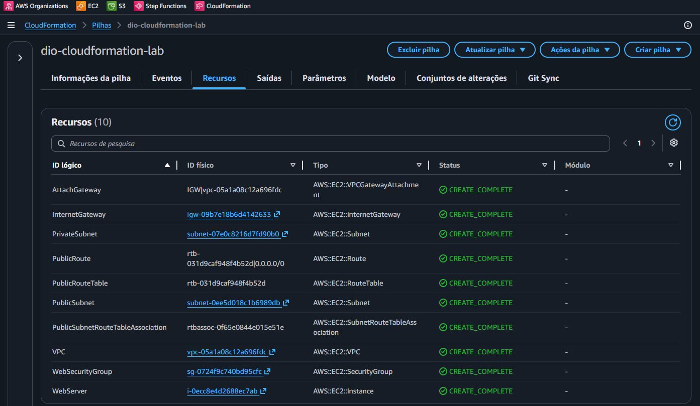
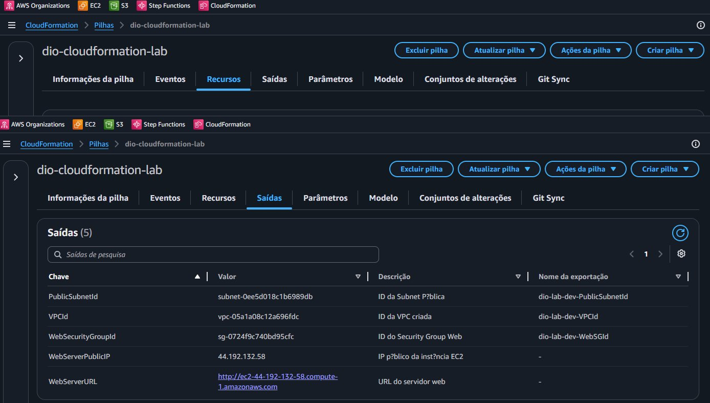
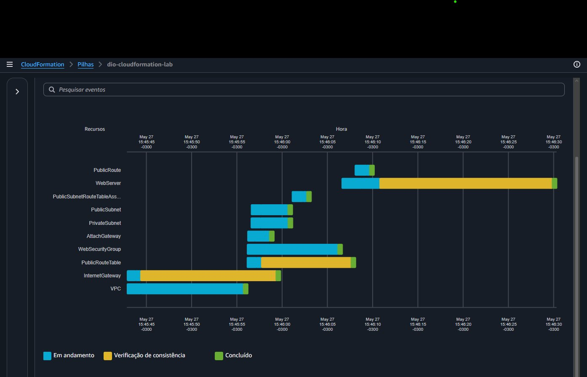

# ☁️ Infraestrutura Automatizada com AWS CloudFormation

[](https://aws.amazon.com/cloudformation/)
[]()
[](https://dio.me)

> Repositório desenvolvido como entregável do laboratório prático da **Digital Innovation One (DIO)**, com foco em automação de infraestrutura utilizando **AWS CloudFormation** (Infrastructure as Code).

---

## 📋 Índice

- [Sobre o Projeto](#-sobre-o-projeto)
- [O que é AWS CloudFormation?](#-o-que-é-aws-cloudformation)
- [Conceitos Fundamentais](#-conceitos-fundamentais)
- [Arquitetura Implementada](#-arquitetura-implementada)
- [Pré-requisitos](#-pré-requisitos)
- [Como Utilizar os Templates](#-como-utilizar-os-templates)
- [Estrutura do Repositório](#-estrutura-do-repositório)
- [Principais Aprendizados](#-principais-aprendizados)
- [Dicas e Boas Práticas](#-dicas-e-boas-práticas)
- [Recursos Úteis](#-recursos-úteis)

---

## 💡 Sobre o Projeto

Este repositório documenta minha jornada prática no laboratório de **Infraestrutura como Código (IaC)** com AWS CloudFormation. O objetivo foi aprender a provisionar, gerenciar e automatizar recursos na nuvem AWS de forma declarativa, eliminando processos manuais e garantindo consistência entre ambientes.

### Objetivos Alcançados

- [x] Compreensão da estrutura de um template CloudFormation (YAML/JSON)
- [x] Criação de stacks com recursos interdependentes
- [x] Uso de parâmetros, outputs e mappings
- [x] Provisionamento de infraestrutura de rede (VPC, Subnets, Security Groups)
- [x] Deploy e atualização de stacks via Console e AWS CLI
- [x] Aplicação de boas práticas de IaC

---

## ☁️ O que é AWS CloudFormation?

O **AWS CloudFormation** é um serviço que permite modelar e provisionar recursos da AWS usando templates em **YAML** ou **JSON**. Com ele, você descreve a infraestrutura desejada de forma declarativa — o CloudFormation cuida do provisionamento e da ordem de criação dos recursos automaticamente.

### Benefícios Principais

| Benefício | Descrição |
|---|---|
| **Automação** | Provisionamento de centenas de recursos com um único comando |
| **Consistência** | Ambientes idênticos a partir do mesmo template |
| **Rastreabilidade** | Histórico de mudanças versionado no Git |
| **Rollback automático** | Em caso de falha, o CloudFormation reverte o estado anterior |
| **Sem custo adicional** | Pague apenas pelos recursos criados, não pelo serviço em si |

---

## 🧩 Conceitos Fundamentais

### 1. Template

Arquivo YAML ou JSON que descreve os recursos AWS a serem provisionados. Estrutura básica:

```yaml
AWSTemplateFormatVersion: '2010-09-09'
Description: 'Descrição do template'

Parameters:      # Entradas dinâmicas
Mappings:        # Mapeamentos de valores
Conditions:      # Lógica condicional
Resources:       # Recursos a serem criados (OBRIGATÓRIO)
Outputs:         # Valores exportados após criação
```

### 2. Stack

Uma **Stack** é uma coleção de recursos AWS gerenciados como uma única unidade. Ao criar, atualizar ou excluir uma stack, o CloudFormation provisiona, modifica ou remove todos os recursos definidos no template.

### 3. Change Set

Antes de atualizar uma stack em produção, é possível criar um **Change Set** — uma prévia das mudanças que serão aplicadas, sem executá-las imediatamente. Isso evita surpresas em ambientes críticos.

### 4. Drift Detection

Permite identificar se os recursos da stack foram modificados manualmente fora do CloudFormation (desvio de configuração), garantindo que o estado real bata com o template.

### 5. Nested Stacks

Stacks podem referenciar outras stacks, permitindo modularização da infraestrutura em componentes reutilizáveis.

---

## 🏗️ Arquitetura Implementada

A infraestrutura provisionada neste laboratório contempla uma arquitetura básica de aplicação web na AWS:

```
┌─────────────────────────────────────────────────────────┐
│                        AWS Cloud                         │
│                                                          │
│  ┌──────────────────── VPC (10.0.0.0/16) ─────────────┐ │
│  │                                                      │ │
│  │   ┌─────────────────────┐  ┌─────────────────────┐  │ │
│  │   │   Public Subnet     │  │   Private Subnet    │  │ │
│  │   │   (10.0.1.0/24)     │  │   (10.0.2.0/24)     │  │ │
│  │   │                     │  │                     │  │ │
│  │   │  ┌──────────────┐   │  │  ┌──────────────┐   │  │ │
│  │   │  │  EC2 Instance│   │  │  │  RDS Instance│   │  │ │
│  │   │  │  (Web Server)│   │  │  │  (Database)  │   │  │ │
│  │   │  └──────────────┘   │  │  └──────────────┘   │  │ │
│  │   └─────────────────────┘  └─────────────────────┘  │ │
│  │                                                      │ │
│  │              Internet Gateway                        │ │
│  └──────────────────────────────────────────────────────┘ │
└─────────────────────────────────────────────────────────┘
```

**Recursos provisionados:**
- VPC com CIDR `10.0.0.0/16`
- 2 Subnets (pública e privada)
- Internet Gateway + Route Table
- Security Groups (Web e Database)
- EC2 Instance (Amazon Linux 2)
- Parâmetros configuráveis (tipo de instância, nome do ambiente)

---

## ✅ Pré-requisitos

Antes de usar os templates deste repositório, certifique-se de ter:

- Conta AWS ativa ([criar conta gratuita](https://aws.amazon.com/free/))
- AWS CLI instalado e configurado:
  ```bash
  aws configure
  # Informe: Access Key ID, Secret Access Key, região e formato de saída
  ```
- Permissões IAM adequadas (`CloudFormationFullAccess`, `EC2FullAccess`, etc.)
- Git instalado localmente

---

## 🚀 Como Utilizar os Templates

### Via AWS Console

1. Acesse o [AWS CloudFormation Console](https://console.aws.amazon.com/cloudformation)
2. Clique em **"Create stack" → "With new resources (standard)"**
3. Selecione **"Upload a template file"** e escolha o arquivo `.yaml`
4. Preencha os parâmetros solicitados
5. Revise as configurações e clique em **"Create stack"**
6. Acompanhe os eventos na aba **"Events"** até o status `CREATE_COMPLETE`

### Via AWS CLI

```bash
# Criar uma nova stack
aws cloudformation create-stack \
  --stack-name minha-stack \
  --template-body file://templates/vpc-stack.yaml \
  --parameters ParameterKey=Environment,ParameterValue=dev \
  --capabilities CAPABILITY_IAM

# Verificar o status da stack
aws cloudformation describe-stacks \
  --stack-name minha-stack \
  --query 'Stacks[0].StackStatus'

# Atualizar uma stack existente
aws cloudformation update-stack \
  --stack-name minha-stack \
  --template-body file://templates/vpc-stack.yaml

# Excluir a stack (e todos os recursos)
aws cloudformation delete-stack \
  --stack-name minha-stack
```

---

## 📁 Estrutura do Repositório

```
📦 aws-cloudformation-lab/
├── 📄 README.md                    # Este arquivo
├── 📁 templates/
│   ├── 📄 vpc-stack.yaml           # Template de VPC completa
│   ├── 📄 ec2-stack.yaml           # Template de instância EC2
│   └── 📄 full-infrastructure.yaml # Template completo (VPC + EC2 + SG)
├── 📁 images/
│   ├── 🖼️ stack-criada.png          # Print do console após criação
│   ├── 🖼️ recursos-provisionados.png # Recursos na stack
│   └── 🖼️ arquitetura.png           # Diagrama de arquitetura
└── 📁 docs/
    └── 📄 anotacoes.md             # Notas detalhadas das aulas
```

---

## 📚 Principais Aprendizados

### 🔑 Insights da Prática

**1. A ordem importa — mas o CloudFormation cuida disso**
Ao definir uma dependência entre recursos (ex.: Security Group referenciando uma VPC), o CloudFormation detecta a ordem correta de criação automaticamente via `Ref` e `DependsOn`.

**2. Parâmetros tornam templates reutilizáveis**
Em vez de criar um template para cada ambiente, usar `Parameters` permite passar valores dinâmicos na criação da stack:
```yaml
Parameters:
  Environment:
    Type: String
    AllowedValues: [dev, staging, prod]
    Default: dev
```

**3. Outputs facilitam a integração entre stacks**
Exportar valores como IDs de VPC ou ARNs permite que outras stacks os referenciem via `Fn::ImportValue`, promovendo modularidade.

**4. Sempre use Change Sets antes de atualizar produção**
Aprendi que atualizar uma stack diretamente pode causar substituição ou deleção de recursos. O Change Set mostra o impacto antes de aplicar qualquer mudança.

**5. Tags são essenciais para governança**
Adicionar tags de `Environment`, `Project` e `Owner` a todos os recursos facilita muito o controle de custos e a rastreabilidade.

### ⚠️ Erros Comuns e Como Evitar

| Erro | Causa | Solução |
|---|---|---|
| `ROLLBACK_COMPLETE` | Erro durante criação de recurso | Verificar aba "Events" para identificar o recurso com falha |
| `ValidationError` | Sintaxe incorreta no template | Validar com `aws cloudformation validate-template` |
| `InsufficientCapabilities` | Template cria recursos IAM | Adicionar `--capabilities CAPABILITY_IAM` |
| Recursos órfãos | Deleção de stack com S3 não vazio | Esvaziar o bucket antes ou usar `DeletionPolicy: Retain` |

---

## 💡 Dicas e Boas Práticas

- **Valide sempre antes de criar:** `aws cloudformation validate-template --template-body file://template.yaml`
- **Use YAML, não JSON:** Mais legível, suporta comentários (`#`) e é menos verboso
- **Versione seus templates no Git:** Trate IaC como código — com commits, branches e revisões
- **Separe por responsabilidade:** Crie stacks separadas para rede, segurança e aplicação
- **Defina `DeletionPolicy`:** Para recursos com dados críticos (S3, RDS), use `DeletionPolicy: Snapshot` ou `Retain`
- **Use o CloudFormation Designer:** Ferramenta visual no Console que ajuda a visualizar dependências
- **Habilite Stack Termination Protection:** Evita exclusão acidental de stacks de produção

---

## 📸 Evidências da Prática

### ✅ Stack criada com sucesso — `CREATE_COMPLETE`


---

### 📦 Recursos provisionados (10 recursos)
> VPC, Subnets, Internet Gateway, Route Table, Security Group e EC2 — todos com `CREATE_COMPLETE`



---

### 📤 Saídas da stack (Outputs)
> IP público da EC2 (`44.192.132.58`), ID da VPC, ID da Subnet e URL do servidor web exportados automaticamente



---

### 📋 Timeline de eventos de criação
> Gráfico de Gantt mostrando a ordem e duração de criação de cada recurso. A VPC e o Internet Gateway foram criados primeiro, depois as Subnets e por último o WebServer (EC2)



---

## 🔗 Recursos Úteis

- [Documentação Oficial AWS CloudFormation](https://docs.aws.amazon.com/cloudformation/)
- [Guia de Templates CloudFormation](https://docs.aws.amazon.com/AWSCloudFormation/latest/UserGuide/template-guide.html)
- [AWS CloudFormation — Referência de Recursos](https://docs.aws.amazon.com/AWSCloudFormation/latest/UserGuide/aws-template-resource-type-ref.html)
- [AWS Free Tier](https://aws.amazon.com/free/) — Para praticar sem custos
- [cfn-lint](https://github.com/aws-cloudformation/cfn-lint) — Linter para templates CloudFormation
- [Formação GitHub Certification — DIO](https://aline-antunes.gitbook.io/formacao-fundamentos-github)

---

## 👤 Autor

Desenvolvido como parte do Bootcamp da **[Digital Innovation One (DIO)](https://dio.me)**.

---

> *"Infrastructure as Code não é sobre escrever menos — é sobre escrever melhor, de forma reproduzível e auditável."*
